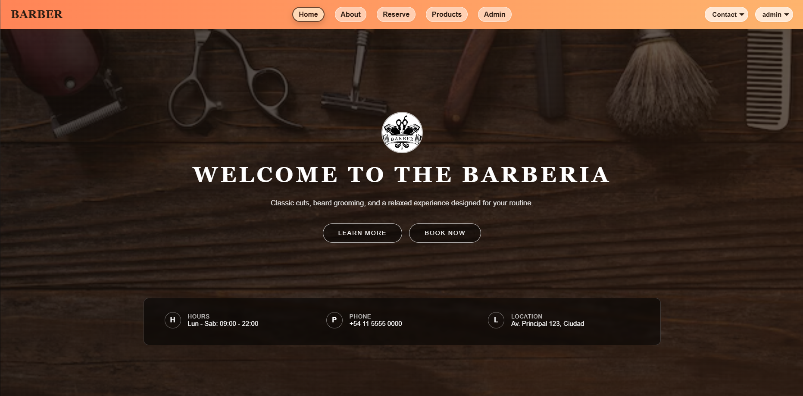
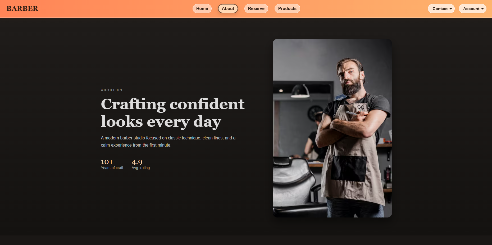
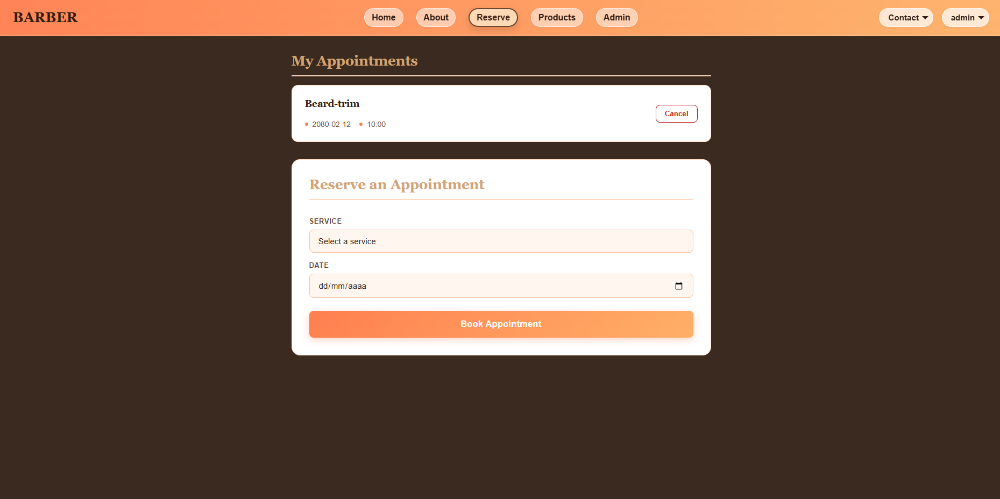
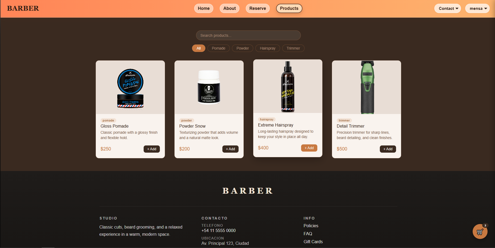
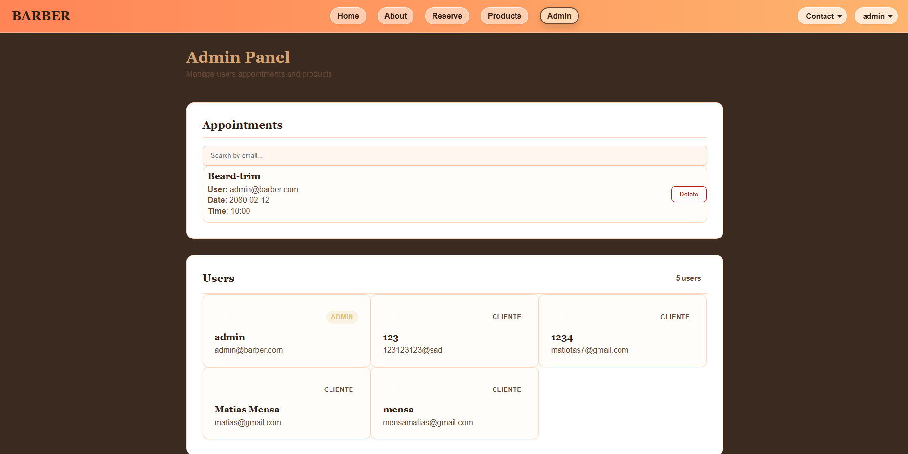
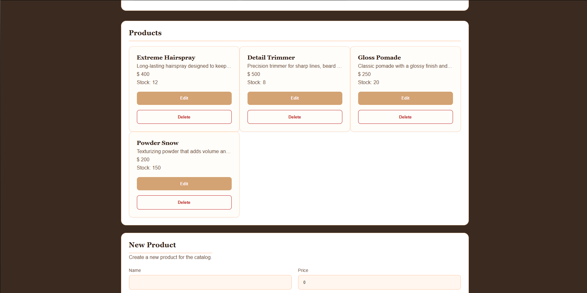

# Barber

Barber is a modern web application built with Angular for the comprehensive management of a barbershop. It allows users to register, log in, book appointments, and explore products, while also providing an administrative panel to manage users, bookings, and catalog items.

## Overview

Barber is a Single Page Application (SPA) designed to deliver a fast and intuitive experience for both customers and administrators. The interface follows a mobile-first approach, ensuring smooth navigation on mobile devices and proper adaptation to larger screens.

## Main features

### Authentication and user roles
- New user registration.
- Login with personal credentials.
- Persistent session using local storage.
- Role-based access: customer and administrator.
- Route protection with guards based on user type.

### Appointment booking
- Booking appointments for different services.
- Validation of required fields.
- Restriction of past dates.
- Availability checking for time slots.
- Prevention of duplicate bookings in the same time slot.
- Cancellation of existing appointments.
- Viewing of appointments for the authenticated user.

### Product catalog
- Display of available products.
- Product search.
- Filtering by category.
- Responsive design for different screen sizes.

### Admin panel
- Exclusive access for administrators.
- Management of registered users.
- Management of system appointments.
- Search appointments by email address.
- Deletion of appointments.
- Product management with create, edit, and delete operations.

## Technologies used

- Angular 21
- TypeScript
- HTML5
- CSS3
- RxJS
- Angular Router
- Angular Forms
- Supabase as database and backend

## Project architecture

The project is organized into reusable modules and components:

- Components: user interfaces.
- Services: business logic and data access.
- Models: entity definitions for users, appointments, and products.
- Guards: route protection based on permissions.
- Supabase: persistent storage of application data.

## Project structure

```text
src/
  app/
    admin/
    appointments-management/
    auth/
    guards/
    home/
    models/
    navbar/
    product-management/
    products/
    reserve/
    services/
    shared/
    user-management/
```

## Installation

1. Clone the repository:

```bash
git clone https://github.com/MensaMatias/Barber.git
```

2. Enter the project directory:

```bash
cd Barber
```

3. Install dependencies:

```bash
npm install
```

4. Run the application:

```bash
npm start
```

5. Open the browser at:

```text
http://localhost:4200
```

## Supabase configuration

The application uses Supabase to store users, appointments, and products. In the current project, the connection is configured directly in the corresponding service file. For a production environment, it is recommended to move the credentials to environment variables.

## Security

- Access control is implemented through guards to protect sensitive routes.
- The application uses Supabase as its persistence layer.
- Administrative operations are restricted to users with an administrator role.

## Screenshots

### Home


### About


### Appointment management


### Product catalog


### Administration panel



## Repository

- GitHub: https://github.com/MensaMatias/Barber

## Author

Matías Mensa